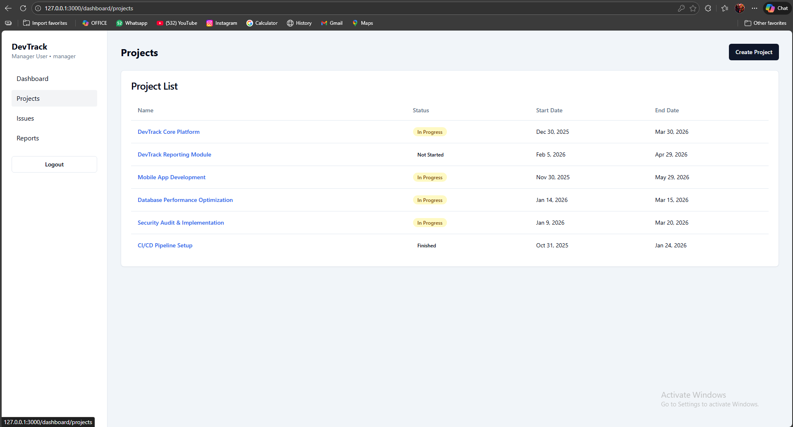
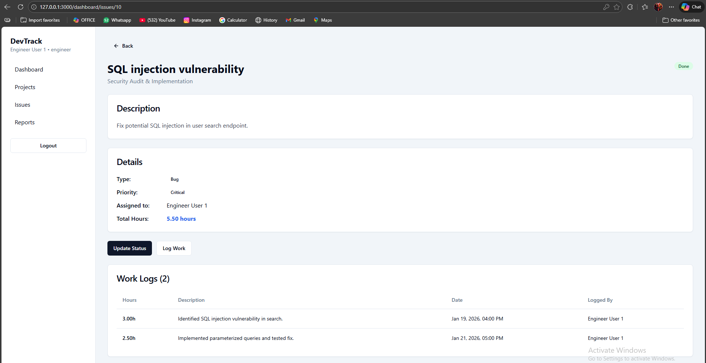
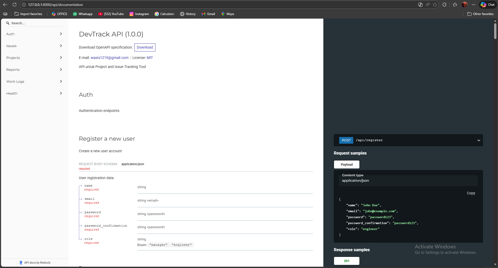

## DevTrack

DevTrack adalah aplikasi pelacakan proyek dan issue untuk tim engineering, dengan role **manager** dan **engineer**.

### Fitur Utama
- Manajemen proyek dan issue
- Penugasan issue ke engineer
- Pencatatan work log per issue
- Laporan project (status & total hours)
- Role-based access (manager melihat semua data)

### Stack
- Backend: Laravel + PostgreSQL
- Frontend: Next.js
- Docker: Compose untuk PostgreSQL, Backend, Frontend

---

## Screenshots

### Dashboard Manager


### Dashboard Engineer


### API Documentation


---

## Quick Start (Docker)

1. Pastikan Docker dan Docker Compose terinstall.
2. Jalankan:

```
docker compose up -d --build
```

3. Seed database:

```
docker exec devtrack-backend php artisan db:seed --force
```

4. Akses:
- Frontend: http://localhost:3000
- Backend API: http://localhost:8000/api

### Akun Contoh
- Manager: manager@devtrack.com / password123
- Engineer: engineer1@devtrack.com / password123

---

## Development (Local)

### Backend (Laravel)
```
cd be-devtrack
composer install
php artisan migrate
php artisan db:seed
php artisan serve
```

### Frontend (Next.js)
```
cd fe-devtrack
npm install
npm run dev
```

---

## CI/CD

Workflow GitHub Actions berada di:
[.github/workflows/docker-image.yml](.github/workflows/docker-image.yml)

---

## Struktur Repo
- Backend: [be-devtrack](be-devtrack)
- Frontend: [fe-devtrack](fe-devtrack)
- Docker Compose: [docker-compose.yml](docker-compose.yml)
- Dokumentasi Docker: [DOCKER.md](DOCKER.md)

